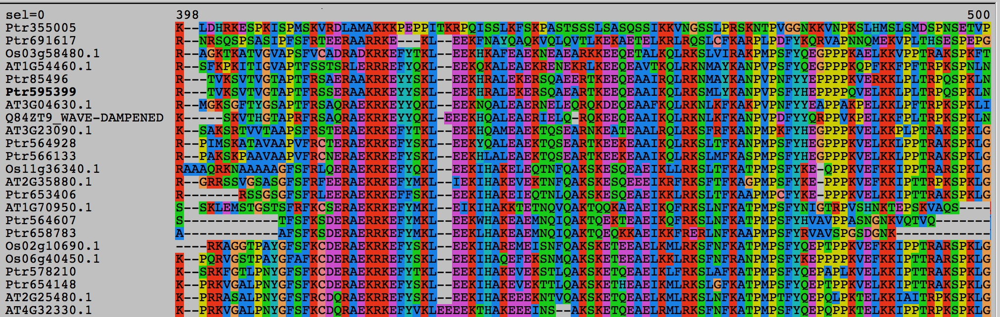

## KLEEK aligned
## Instructions:

Note: This assignment is connected to the motif filter assignment.

Determine whether the sequences are conserved enough around the KLEEK motif that its alignment is perfect: the motif sequences are lining up.

Take the test file and retrieve the sequences that contain the KLEEK motif. Use the program 'muscle' to compute a multialignment of the KLEEK sequences. Use the alignment viewer 'seaview' to inspect the alignment. How well do the KLEEK motifs align? Utilizing known sequence features is a good way of ensuring that a multiple sequence alignment is good.

## To present:
Explain the purpose of multialignments! 

> Does the KLEEK motif line up in your multialignment?

http://assets.geneious.com/manual/8.0/GeneiousManualse38.html#GeneiousManualsu62.html

There is a lot of variation between the sequences. The KLEEK motif it is indeed lined up in the multialingment.

